<picture>
  <source media="(prefers-color-scheme: dark)" srcset="images/hero-dark.png">
  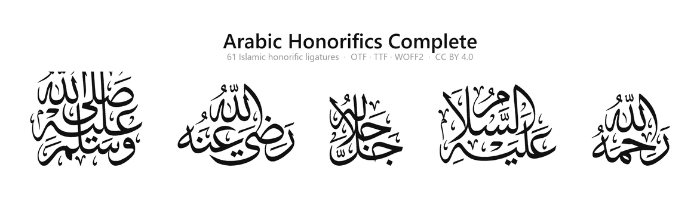
</picture>

# Arabic Honorifics Complete

An OpenType font of **61 Arabic Islamic honorific ligatures** in the classical
Thuluth/Naskh printing tradition — the forms you see in editions from publishers
like Dar al-Minhaj, but freely usable.

Built from the artwork of
**[baalwi-id/arabic-honorific-ligatures](https://github.com/baalwi-id/arabic-honorific-ligatures)**
by [BaAlwi Heritage (ID)](https://baalwi.net), which is released under CC BY 4.0.
This repository turns that artwork into an installable font. All credit for the
calligraphy belongs to them — see [CREDITS.md](CREDITS.md).

| | |
|---|---|
| Family name | `Arabic Honorifics Complete` |
| Glyphs | 61 honorifics |
| Real Unicode codepoints | 20 |
| Private Use Area | 41 (`U+E900`–`U+E93C`) |
| Formats | OTF · TTF · WOFF2 · WOFF |
| Licence | CC BY 4.0 |

**[→ Browse all 61 glyphs interactively](https://eraduz.github.io/ArabicHonorificsComplete/)**

---

## Install

Download this repository ([ZIP](https://github.com/eraduz/ArabicHonorificsComplete/archive/refs/heads/main.zip)),
open the `fonts/` folder, then:

- **Windows** — select the `.otf` and `.ttf`, right-click → **Install for all users**
- **macOS** — double-click `ArabicHonorificsComplete-Regular.otf` → **Install Font**
- **Linux** — copy into `~/.local/share/fonts/` and run `fc-cache -f`

> Use the **`.ttf`** if you mainly work in Microsoft Office, the **`.otf`** for Adobe
> apps and print. Installing both is fine. The `.woff2`/`.woff` are for websites.

---

## Using it in Word

**The quickest way** — open the [glyph browser](https://eraduz.github.io/ArabicHonorificsComplete/),
click **copy glyph** on the one you want, paste it into Word, select it, and set
the font to *Arabic Honorifics Complete*.

**Without leaving Word** — type the code from [`cheatsheet.md`](cheatsheet.md) and
press <kbd>Alt</kbd>+<kbd>X</kbd>. Word converts it into the character in place:

| Type | Press | You get | |
|---|---|---|---|
| `FD41` | <kbd>Alt</kbd>+<kbd>X</kbd> | ﷑ | raḍiyallāhu ʿanhu |
| `FDFA` | <kbd>Alt</kbd>+<kbd>X</kbd> | ﷺ | ṣallallāhu ʿalayhi wa sallam |
| `E902` | <kbd>Alt</kbd>+<kbd>X</kbd> | (PUA) | jalla wa ʿala |

Then select that character and apply the font.

**Typing shortcuts anywhere** — install [AutoHotkey v2](https://www.autohotkey.com/)
and run [`typing/honorifics.ahk`](typing/honorifics.ahk). Type a shortcode followed
by a space and it becomes the character:

| Type this, then a space | You get | |
|---|---|---|
| `\rad-radiyallahu-anhu` | ﷑ | raḍiyallāhu ʿanhu |
| `\sal-sallallahu-alayhi-wa-sallam-rounded` | ﷺ | ṣallallāhu ʿalayhi wa sallam |

Every shortcode is just the glyph name with a `\` in front, so there is nothing to
memorise. The full list is in [`cheatsheet.csv`](cheatsheet.csv).

> **On size** — the glyphs are a full em tall and sit on the baseline, so at the
> same point size as your body text they look noticeably larger. That is usually
> what you want. If a honorific stretches the line spacing more than you like, set
> it a few points smaller than the surrounding text.

---

## A picker for Word

Instead of typing codepoints, there is a task-pane add-in: all 61 honorifics in a
searchable list, click one and it lands at the cursor with the font applied.

<!-- installation and details: docs/addin/README.md -->

It exists mainly to make the font-slot problem above impossible: it inserts OOXML
that sets `w:ascii`, `w:hAnsi` and `w:cs` together, so a glyph can never end up
drawn with a font that has no glyph for it. It can also insert the spelled-out
Arabic phrase instead, for text that has to survive leaving your machine.

Works in Word on Windows, Mac and the web. **[Install instructions →](docs/addin/README.md)**

---

## Using it on a website

Copy the `fonts/` folder to your site and link the stylesheet:

```html
<link rel="stylesheet" href="fonts/arabic-honorifics.css">

<p>Muhammad <span class="honorific honorific--inline">&#xFDFA;</span> said…</p>
```

`arabic-honorifics.css` gives you three classes:

| Class | What it does |
|---|---|
| `.honorific` | Renders the character from this font |
| `.honorific--inline` | Optical size + baseline nudge for running text |
| `.honorific--square` | The square ﷺ composition (see below) |

Or write the `@font-face` yourself:

```css
@font-face {
  font-family: "Arabic Honorifics Complete";
  src: url("ArabicHonorificsComplete-Regular.woff2") format("woff2"),
       url("ArabicHonorificsComplete-Regular.woff")  format("woff");
  font-display: swap;
}
```

---

## Will it survive copy-paste?

This is the question everyone hits, so here it is plainly.

**A glyph only exists inside a font.** When you paste text somewhere, you send
*codepoints*, not artwork. Whether the honorific appears depends entirely on
whether the receiving app has a font covering that codepoint. No font can change
that — it is how text works.

What this font does about it is pick the codepoints carefully:

**20 glyphs sit at real Unicode codepoints** (`U+FD40`–`U+FD4F`, `U+FDFA`, `U+FDFB`,
`U+FDFE`, `U+FDFF`). Paste one into WhatsApp, Telegram, email or a browser and the
receiving system renders it with *whatever* font it has that covers the character —
Scheherazade New, Noto Naskh Arabic and several system fonts do. It may not look
like this artwork, but it will be the correct honorific rather than a blank box.

**41 glyphs have no Unicode codepoint**, because Unicode has never encoded those
phrases. They live in the Private Use Area. They render perfectly in Word,
InDesign, or a web page that loads this font — and show as a blank box anywhere
the font is absent. That is unavoidable.

| Where you are pasting | What to do |
|---|---|
| A document whose fonts you control | Use any glyph freely |
| A website you build | Use any glyph, ship the WOFF2 |
| Chat, email, someone else's site | Prefer one of the 20 Unicode glyphs |
| Chat, but you need one of the other 41 | Paste the plain Arabic phrase instead |

The [glyph browser](https://eraduz.github.io/ArabicHonorificsComplete/) has a
**copy Arabic text** button on every glyph for that last case — it copies
`رضي الله عنه` instead of the single character, which is readable everywhere with
no font required.

Each glyph's status is in the **Copy-paste safe** column of
[`cheatsheet.md`](cheatsheet.md), and in the labels on the images below: a plain
`U+FD41` is a real codepoint, `U+E91C - PUA` is not.

> **One caveat about monospace.** `U+FD40`–`U+FD4F` were added in Unicode 16.0
> (2024). Regular UI and text fonts on an up-to-date system cover them, but most
> *monospace* fonts do not yet — so in a code editor, a terminal, or a fenced code
> block on GitHub they may show as an empty box even though they are perfectly
> valid characters. In ordinary prose they render fine. `U+FDFA` and `U+FDFB` are
> decades older and render essentially everywhere.

---

## The glyphs

Every glyph below is shown as rendered by this font. Codepoints are labelled;
the full table with Arabic text and transliteration is in
[`cheatsheet.md`](cheatsheet.md).

### `alh` — after the name of Allah

<picture><source media="(prefers-color-scheme: dark)" srcset="images/group-alh-dark.png">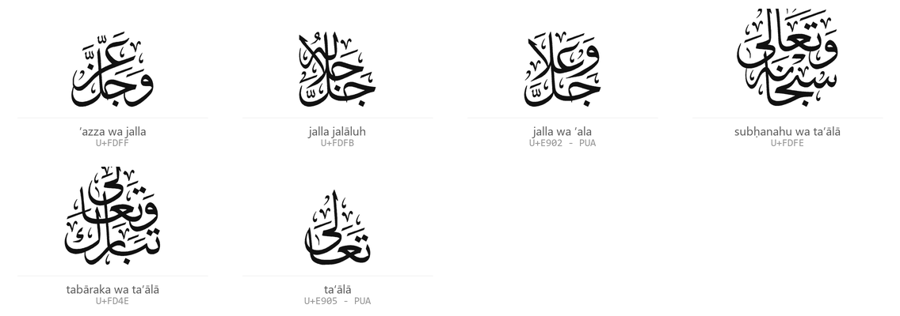</picture>

### `sal` — Sallallahu

<picture><source media="(prefers-color-scheme: dark)" srcset="images/group-sal-dark.png">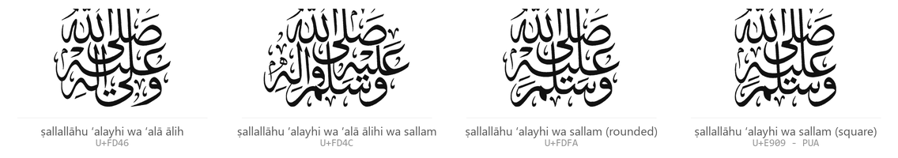</picture>

### `slt` — As-Salatu was-Salam

<picture><source media="(prefers-color-scheme: dark)" srcset="images/group-slt-dark.png">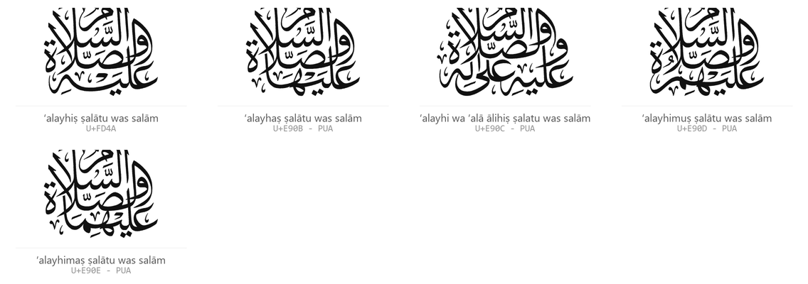</picture>

### `slm` — As-Salam

<picture><source media="(prefers-color-scheme: dark)" srcset="images/group-slm-dark.png">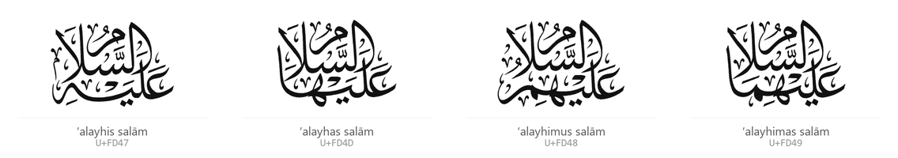</picture>

### `slw` — Salawatullah

<picture><source media="(prefers-color-scheme: dark)" srcset="images/group-slw-dark.png">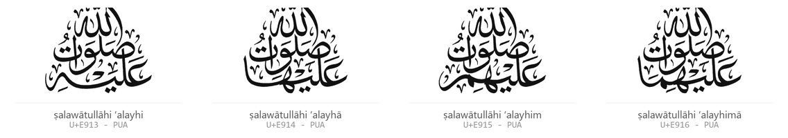</picture>

### `rad` — Radiyallahu

<picture><source media="(prefers-color-scheme: dark)" srcset="images/group-rad-dark.png">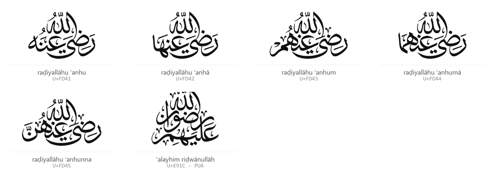</picture>

### `rhm` — Rahimahullah

<picture><source media="(prefers-color-scheme: dark)" srcset="images/group-rhm-dark.png">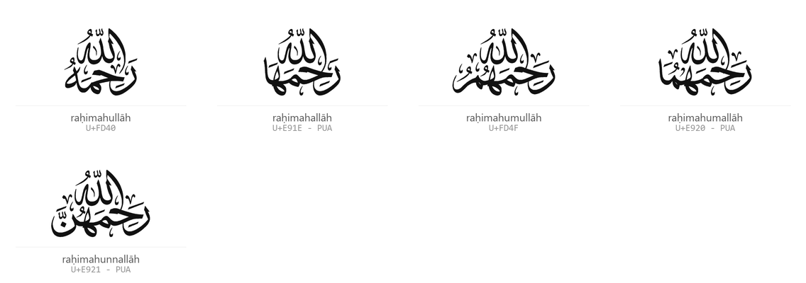</picture>

### `rmt` — Rahmatullah

<picture><source media="(prefers-color-scheme: dark)" srcset="images/group-rmt-dark.png">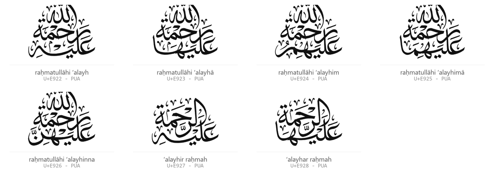</picture>

### `qds` — Qaddasa / Quddisa

<picture><source media="(prefers-color-scheme: dark)" srcset="images/group-qds-dark.png">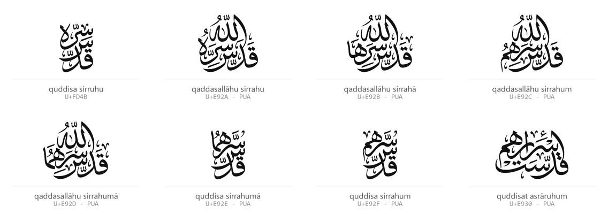</picture>

### `hfz` — Hafizahullah

<picture><source media="(prefers-color-scheme: dark)" srcset="images/group-hfz-dark.png">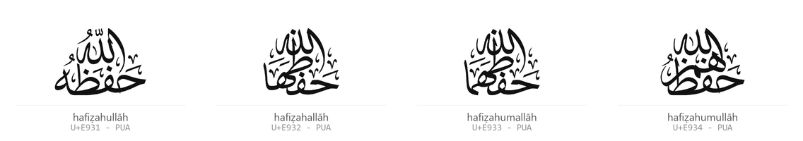</picture>

### `mix` — Mixed

<picture><source media="(prefers-color-scheme: dark)" srcset="images/group-mix-dark.png">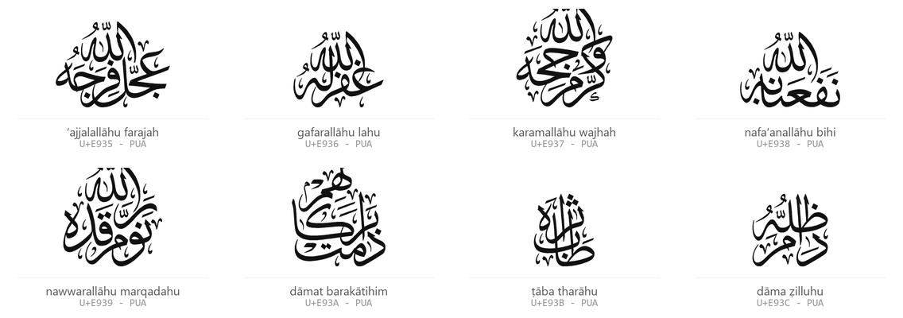</picture>

---

## The square ﷺ

*Sallallahu alayhi wa sallam* ships in two compositions. The rounded one is the
default at `U+FDFA`. To get the square one:

- type its own codepoint `U+E909`, or
- turn on the `ss01` OpenType feature — in Word under
  **Font ▸ Advanced ▸ Stylistic sets**, on the web with
  `font-feature-settings: "ss01"` or the `.honorific--square` class.

---

## What's in this repository

```
fonts/       the font in four formats, plus a ready-to-use stylesheet
docs/        the interactive glyph browser (served by GitHub Pages)
images/      the specimen artwork used in this README
typing/      AutoHotkey script for typing honorifics anywhere on Windows
cheatsheet.md / .csv   every glyph with its codepoint and copy-paste status
```

The glyph browser in `docs/` is a single self-contained HTML file with the font
embedded, so you can also just open it from disk — no server, no internet.

---

## Technical notes

- **Units per em** 1000. The tallest honorific is exactly one em; every glyph sits
  on the baseline with a uniform 40-unit sidebearing.
- All 61 artworks were drawn in one document and therefore share a coordinate
  system, so a **single global scale** was applied rather than normalising each
  glyph. The designer's size relationships are preserved — a three-line
  composition stays taller than a two-line one.
- **Embedding is unrestricted** (`fsType` 0), so the font can be embedded in
  documents and PDFs.
- Vertical metrics carry headroom (`usWinAscent` 1050) so glyphs do not clip in
  Windows applications, and `USE_TYPO_METRICS` is set for consistent line spacing.

### A note on codepoints

The upstream artwork repository lists a codepoint for 40 glyphs. Twenty of those
are codepoints Unicode **does not assign** — they come from an
[unaccepted Unicode proposal](https://www.unicode.org/L2/L2019/19289r-arabic-honorifics.pdf)
and from Scheherazade New's private encoding (`U+FBC3`, `U+FBC4`, `U+FBC6`,
`U+FBC7`, `U+FBCA`, `U+FBCC`, `U+FBCE`, `U+FBCF`, `U+FBD1`, `U+FBD2`, `U+FD90`,
`U+FD91`, `U+FDCE`, `U+10ED1`–`U+10ED8`).

Mapping a glyph to an unassigned codepoint is worse than using the Private Use
Area: Unicode may later assign it to something entirely different, silently
corrupting old documents. Every codepoint in this font was therefore validated
against the Unicode Character Database (16.0.0), and a Unicode mapping is only
used where the character genuinely exists. Everything else is PUA.

**Every glyph is also reachable at a PUA codepoint**, including the 20 with real
ones. Use the Unicode codepoint when the text may travel; use the PUA codepoint
when you specifically want *this* artwork and the font is guaranteed present.

---

## If a glyph shows as an empty box in Word

If the Unicode honorifics render but the PUA ones (`U+E900`–`U+E93C`) come out as
empty boxes, the font is fine — Word is looking in the wrong place.

Word keeps **two font settings per run**: one for Latin text and one for complex
scripts. It picks between them by the *script* of each character:

| Character | Unicode script | Word uses | Result |
|---|---|---|---|
| `U+FD41` and the other 19 | Arabic | the **complex scripts** font | renders |
| `U+E900`–`U+E93C` | Common (PUA has no script) | the **Latin text** font | box, if that font is not this one |

So a document can have *Arabic Honorifics Complete* set as its complex-scripts
font, draw all 20 Unicode honorifics perfectly, and still show boxes for the
other 41 — because those are being drawn with whatever the Latin font is.

**The fix.** Select the affected text, press <kbd>Ctrl</kbd>+<kbd>D</kbd>, and set
**both** *Latin text font* and *Complex scripts font* to Arabic Honorifics
Complete. Setting the font from the Home ribbon usually does this for you, but
not when the run already carries an explicit Latin font.

This is a property of how Unicode classifies the Private Use Area, not something
a font can override. It is also the price of the codepoint choice explained
above: mapping these glyphs into unassigned Arabic codepoints would make Word
route them to the complex-scripts slot, but would break the documents the day
Unicode assigns those codepoints to something else.

## Credits

The calligraphy is the work of **[BaAlwi Heritage (ID)](https://baalwi.net)** and is
published at **[baalwi-id/arabic-honorific-ligatures](https://github.com/baalwi-id/arabic-honorific-ligatures)**
under CC BY 4.0. This repository only packages that artwork as a font.

Full attribution in [CREDITS.md](CREDITS.md).

## Licence

[CC BY 4.0](LICENSE) — the same licence as the source artwork. You may use, share
and adapt this font for any purpose including commercial, as long as you credit
**BaAlwi Heritage (ID)** and indicate changes.
